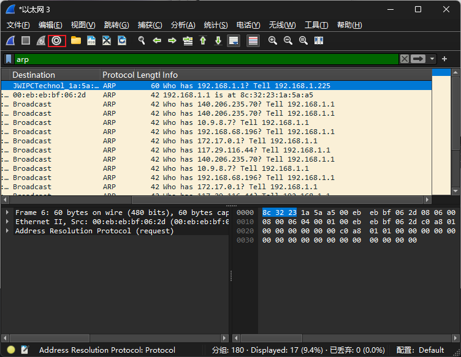

# 配置小牌网络摄像头的方法
我们团队想尝试与网络摄像头有关的项目，需要尝试学习配置摄像头相关的知识，我的家中正好有一台久远的小牌网络摄像头，家中的录像机自带有DVR系统，我想尝试使用个人电脑实现相同的功能，在个人电脑上也能显示摄像头拍摄的录像，于是有了下面的尝试。
## 1.通过网线和电源线连接电脑与摄像头
有些高级的网络摄像头直接通过网线供电，可以不使用电源线
## 2.配置个人电脑以太网

ip地址可以先像图中给出的一样填写
## 3.下载wireshark软件查看摄像头ip

如图，我的网络摄像头的ip为192.168.1.1
## 4.在电脑下载Agent DVR并配置
\
配置完成以后，电脑应该就可以显示摄像头录像了